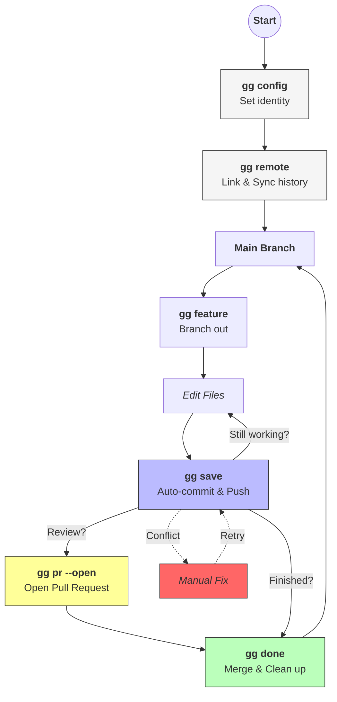

# gg 🦀

**gg** is a high-level Git workflow automation tool written in Rust. It’s designed for developers who want the power of Git without the cognitive overhead of managing rebases, upstream tracking, or conventional commit formatting manually.

## ✨ Features

- **Intuitive Remotes**: `gg remote <url>` doesn't just set a string; it fetches, tracks, and automatically rebases unrelated histories (perfect for syncing local-first projects with new GitHub repos).
- **Smart Saving**: `gg save` analyzes your diffs to generate **Conventional Commits** (e.g., `feat(main.rs): added file`) automatically.
- **Fail-Fast Safety**: Prevents destructive operations if your working directory is dirty.
- **Automated Workflows**: 
    - `feature`: Syncs main, branches out, and sets up tracking in one go.
    - `done`: Merges, cleans up, and returns you to safety.
- **Smart Auth**: Transparently handles SSH Agents, disk-based SSH keys (`RSA`, `ED25519`), and HTTPS Credential Helpers.

## Workflow


## 🚀 Quick Start

### 1. Configure your identity
```bash
gg config "Your Name" "email@example.com" --global
```

2. Start a project and link it

Instead of fighting with --allow-unrelated-histories:
```bash
git init
gg save -m "Initial work"
gg remote git@github.com:user/repo.git
```

3. Save your work
```bash
# Automatically generates: feat: added 3 files (+12, -0, ~0)
gg save

# Or see what it would do:
gg save --dry-run
```

4. Create a Pull Request
```bash
# Output the link to stdout
gg pr

# Or open it directly in your browser
gg pr --open
```

🛠 Commands
|Command|Description|
|---|---|
|pull|Pulls from the remote|
|push|Pushes to the remote|
|features|Lists all branches|
|feature -n <name>|Pulls latest, switches to a new branch, and pushes upstream.|
|save [-m msg]|Pulls, stages all, commits (auto-conventional), and pushes.|
|pr [--open]|Generates - and optionally opens - a link to create a PR on the appropriate service, if any|
|done [--no-clean]|Switches to main, pulls, and deletes the feature branch.|
|remote <url>|Sets remote and performs an auto-rebase sync of histories.|
|config <n> <e>|Sets Git user.name and user.email.|

## 🧠 How the Auto-Sync Works

When you run gg remote, the tool performs a specialized sync:

1. It fetches the remote state.
2. It detects if the local and remote histories are unrelated.
3. It rebases your local commits onto the remote's HEAD.
4. It sets up upstream tracking so you never have to type git push -u origin main again.

GPLv3
